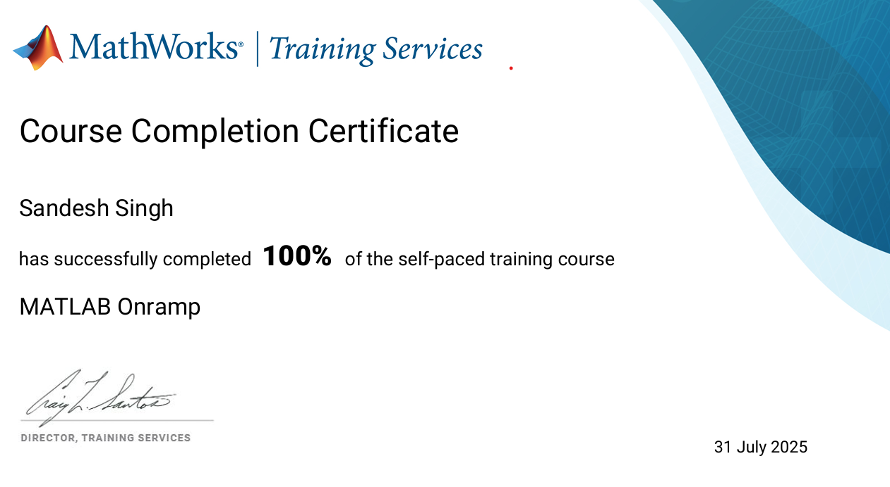

# Digital-Image-Processing

#  MATLAB Onramp Completion

I’m excited to share that I have successfully completed the **MATLAB Onramp Course** ✅  

This course provided me with a strong foundation in MATLAB programming and practical problem-solving skills.  

Special thanks to **Prof. Tapan Jain** (Digital Image Processing Faculty) for guidance and encouragement throughout this journey 🙏 

Looking forward to applying this knowledge in my projects on **Digital Image Processing and Computational Applications**.  

---

📌 *Certificate of Completion*  
 <!-- Replace with your certificate image file path -->

#MATLAB #DigitalImageProcessing #LearningJourney
#Adding bitslicing and histogram equaliser in...